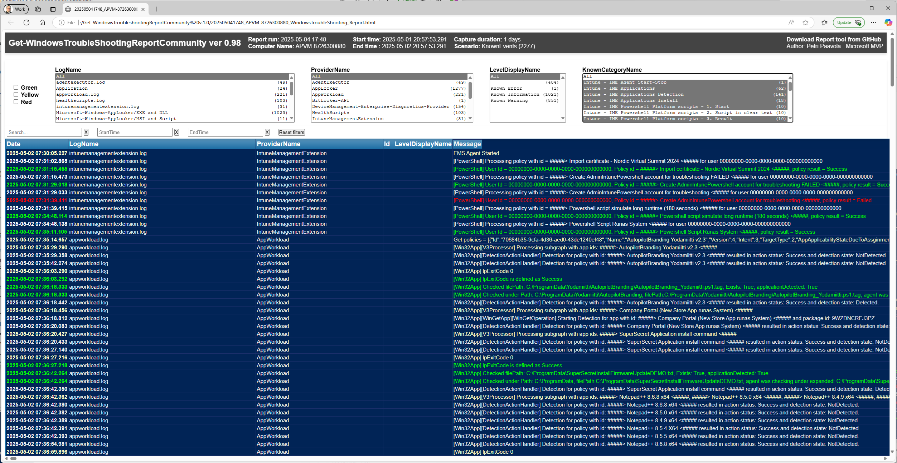

# 🚀 Get-WindowsTroubleshootingReportCommunity v1.0


The **Ultimate Windows and Intune Troubleshooting Tool** for analyzing and visualizing Windows Event logs and structured log files.

Download: [📦 Get-WindowsTroubleshootingReportCommunity_v1.0.zip](./Get-WindowsTroubleshootingReportCommunity_v1.0.zip)

Join the community to contribute and share custom event detection rules for even better troubleshooting experiences.

---

## 📚 Table of Contents

- [What's New (v1.0)](#whats-new-v10)
- [Features](#features)
- [Usage](#usage)
- [Parameters](#parameters)
- [How It Works](#how-it-works)
- [Contributing](#contributing)
- [Scenarios](#scenarios)
- [Example Reports](#example-reports)
- [PowerShell Script Parameters](#powershell-script-parameters)
- [Supported Log Formats](#supported-log-files-and-event-logs)
- [Admin Rights](#do-i-need-to-use-administrative-rights)
- [PowerShell Version Support](#windows-powershell-or-powershell-core)
- [License](#license)
- [Contributors](#contributors)
- [Acknowledgments](#acknowledgments-)

---

## 📢 What's New (v1.0)

**🎉 First Public Release! (Finally 😀)**

> Please report bugs or suggestions via [GitHub Issues](../../issues).

### Changelog Highlights

- LOTS of new features throughout the script  
- New console UI look  
- Improved HTML report  
- Expanded out-of-box **KnownEvent** rules  

---

## 📸 Screenshots

> 📍 Screenshots coming soon

```markdown


```

---

## 🎥 Video Demo (Coming Soon)

```markdown
[](https://www.youtube.com/watch?v=yourvideoid)
```

---

## 🛠️ Features

- **Event Log Support**: Read Windows Event logs from live Windows systems or Intune DiagLogs packages (.zip). Extract .zip file first.
- **Log File Support**: Analyze structured log files containing dateTime and message fields.
- **Unified Timeline**: **Merge event and log file data chronologically.**
- **Rich HTML Reports**: Real-time filtering and searchable HTML output.
- **Scenario-Based Troubleshooting**: Focused support for updates, installs, Intune, etc.
- **Full logs reporting**: Include all logs to report to understand what is happening in all logs.
- **Custom Event Detection**: Detect specific events using customizable `EventRules.json`.
- **Community-Driven**: Share your rules and help others troubleshoot.

---

## ▶️ Usage Examples

```powershell
# Get only KNOWN Events. KnownEvents categories and tima range is selected from graphical UI
./Get-WindowsTroubleshootingReportCommunity_v1.0.ps1

# Get ALL Events. KnownEvents categories, Event logs and log files and tima range is selected from graphical UI
./Get-WindowsTroubleshootingReportCommunity_v1.0.ps1 -AllEvents

# From folder with known events only
./Get-WindowsTroubleshootingReportCommunity_v1.0.ps1 -LogFilesFolder "C:\Logs\DiagLogs-COMPUTERNAME"

# From folder with ALL events
./Get-WindowsTroubleshootingReportCommunity_v1.0.ps1 -LogFilesFolder "C:\Logs\DiagLogs-COMPUTERNAME" -AllEvents

# Known events between two times
./Get-WindowsTroubleshootingReportCommunity_v1.0.ps1 -LogFilesFolder "C:\Logs\DiagLogs-COMPUTERNAME" -StartTime "2024-12-02 08:00:00" -EndTime "2024-12-02 18:00:00"

# All events between two times
./Get-WindowsTroubleshootingReportCommunity_v1.0.ps1 -LogFilesFolder "C:\Logs\DiagLogs-COMPUTERNAME" -StartTime "2024-12-02 08:00:00" -EndTime "2024-12-02 18:00:00" -AllEvents
```

---

## ⚙️ Parameters

- `-AllEvents`: Include all events (not just known).
- `-LogFilesFolder`: Folder with multiple .evtx/log files.
- `-StartTime`, `-EndTime`: Specify exact range.
- `-LogViewerUI`: Launch log review UI.
- `-RealtimeLogViewerUI`: Real-time Event logs monitoring UI.
- `-IncludeSelectedKnownRulesCategoriesOnly`: Filter by known rules.
- `-ExcludeSelectedKnownRulesCategories`: Exclude rule categories.
- `-SortDescending`: Sort newest-first.
- `-ProcmonFilePath`: Include Procmon CSV file.

---

## 🧠 How It Works

1. **Log Processing**: Parses event logs and .log files, combines them into timeline.
2. **Report Generation**: Builds interactive HTML report with filters and search.
3. **Known Event Detection**: Uses rules from `EventRules.json`.
4. **Customization**: Build your own rules with `Create-EventRules-GUI-HelperTool.ps1`.

---

## 🤝 Contributing

- Use `Create-EventRules-GUI-HelperTool.ps1` to create `EventRules.json`.
- Add green (success) and red (fail) markers.
- Submit via GitHub to help others.

---

## 🧪 Scenarios

- **Windows Update**: Status, success/fail, reboots.
- **Intune**: Enrollment, sync, script/app information and errors.
- **Defender for Endpoint**: AV definitions and scans.
- **Software Installs**: MSI/Store installs and issues.
- **System Events**: Restarts, sleep, driver changes.

---

## 📊 Example Reports (Coming soon)

- **Timeline View**
- **Filtered Report**: Only known events or categories

---

## 📘 PowerShell Script Parameters

> Full parameter list is in the script comments or use `Get-Help`.

---

## 🗂️ Supported Log Files and Event Logs

- Full support for **.evtx** logs (online/offline)
- Support for Intune and ConfigMgr **CMTrace-style .log** files
- Experimental support for **Procmon CSV**
- Future: CBS.log, DISM.log, .etl, etc.

---

## 🔐 Do I Need Admin Rights?

- Not required, but highly recommended for full access to Windows Event logs
- **Admin = better coverage**
- Offline logs don’t require admin

---

## 🧩 PowerShell Support

- ✅ PowerShell Core (7.x) - This is preferred and faster!
- ✅ Windows PowerShell 5.1

---

## 📄 License

MIT License — see [LICENSE.md](LICENSE.md)

---

## 👨‍💻 Contributors

- **Petri Paavola** – *Author* (Microsoft MVP - Windows and Intune)
- Petri.Paavola@yodamiitti.fi

---

## 🤖 Acknowledgments

Special thanks to **GPT-4 from OpenAI** for helping with documentation generation, text refactoring, and markdown polishing. AI helped us work faster, so we can troubleshoot better. 💡

---
