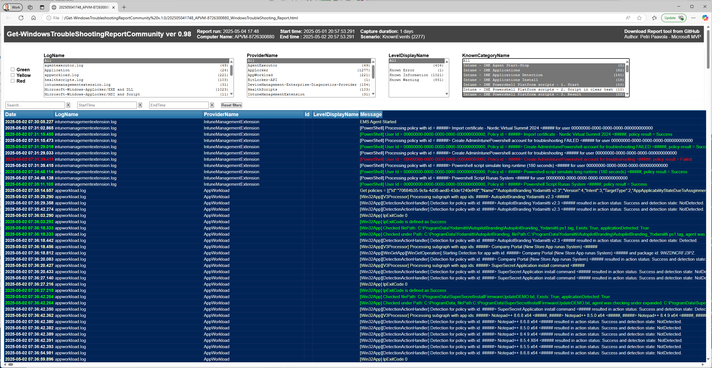
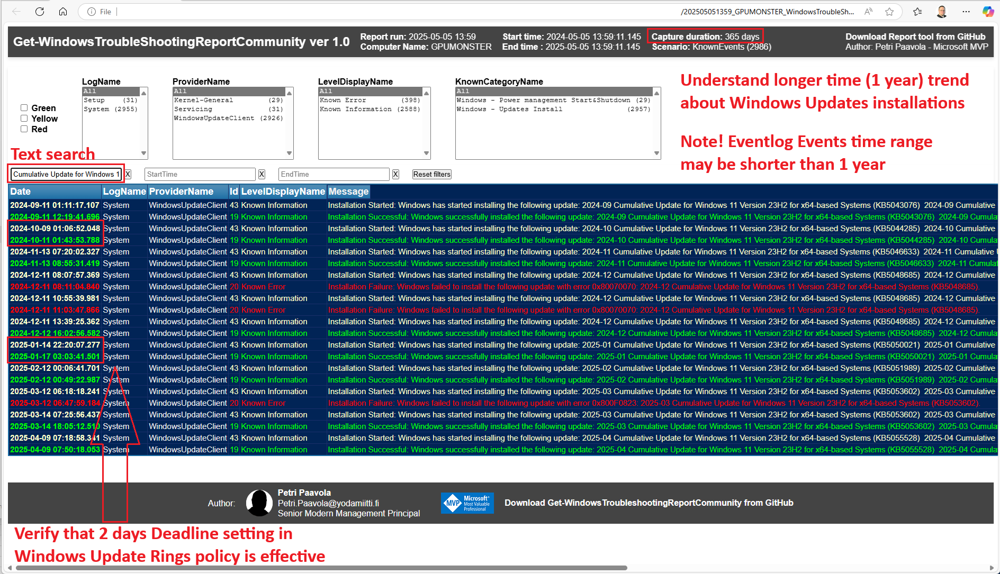
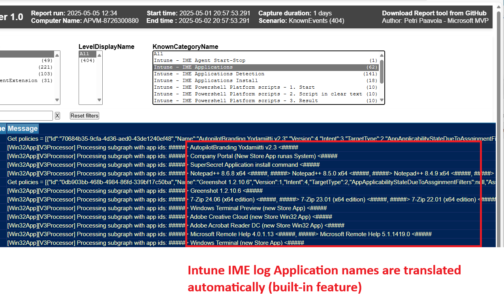
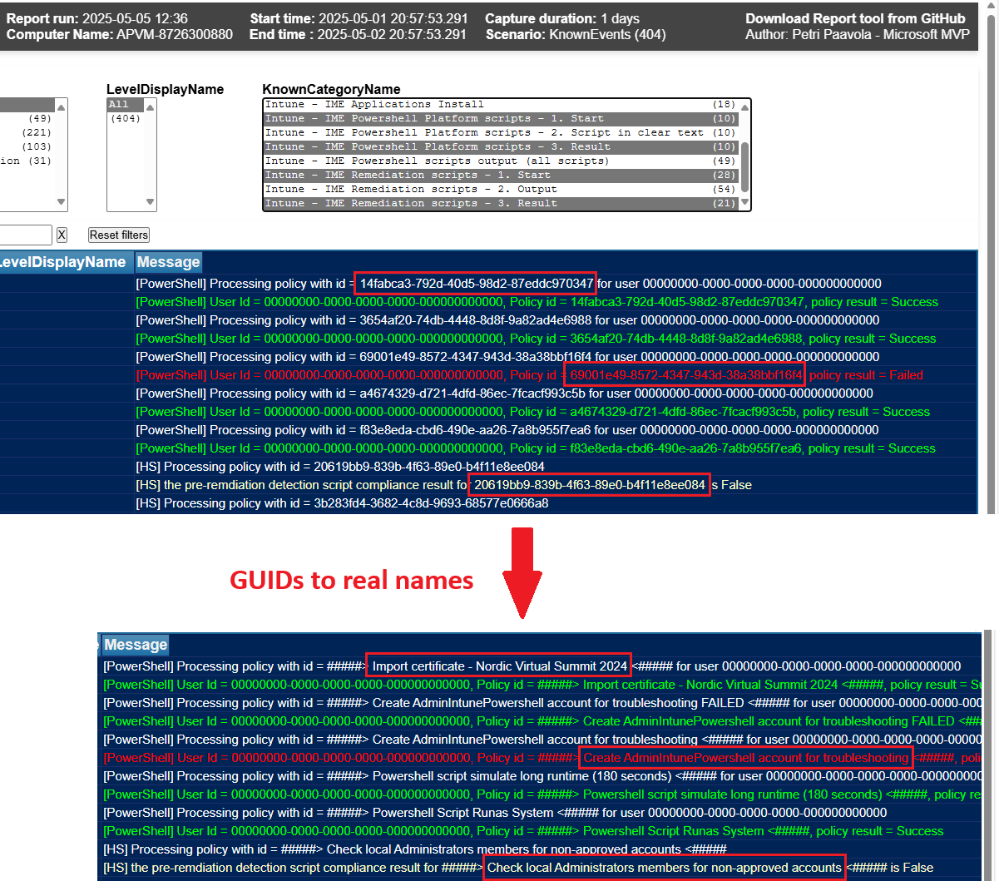

# 🧠 Get-WindowsTroubleshootingReportCommunity v1.1


---
> [!IMPORTANT]
> 🚀 **You will want the latest and greatest – use the Dev version (v3.0)!**  
> The Dev version includes new features and fixes **before they reach the official release (v1.1)**.  
> 👉 [**Download Dev version 3.0 here**](./DeveloperVersion/README.md)

---
## 🔥 The First Tool That Combines Windows Event Logs + .log Files into a Single Unified Timeline Report

Forget siloed logs. This tool **redefines Windows and Intune troubleshooting** by doing what no other tool can:

✅ **Merge** Event Logs (`.evtx`) and traditional `.log` files  
✅ Present everything in a **single, chronological timeline**  
✅ Detect known issues using **community-driven rules**  
✅ Generate clean, interactive **HTML reports with filtering**  
✅ Works with live systems or offline Intune diagnostic packages

> **Built by IT Pros, for IT Pros** — this is your all-in-one troubleshooting lens.  
> It’s not just a script. It’s a **community-powered log intelligence engine**.

---

### 👨‍💻 About the Author

This groundbreaking tool was created by **Petri Paavola**,  
🎖️ *Microsoft MVP (Windows and Intune)* and creator of the widely used  
🔧 [Get-IntuneManagementExtensionDiagnostics](https://github.com/petripaavola/Get-IntuneManagementExtensionDiagnostics) tool.

Petri has helped thousands of IT pros automate and simplify log analysis — this tool takes it to the next level.

---

📦 [**Download the Tool v1.1**](./v1.1/Get-WindowsTroubleshootingReportCommunity_v1.1.zip) and start seeing the full story in your logs.

---

<a name="table-of-contents"></a>
## Table of Contents 📚

- [What's New (v1.1)](#whats-new-v11)
- [What's New (v1.0)](#whats-new-v10)
- [Screenshots](#screenshots)
- [Video Demo](#video-demo) 
- [Features](#features)
- [Usage Examples](#usage-examples)
- [Parameters](#parameters)
- [How It Works](#how-it-works)
- [Contributing](#contributing)
- [Scenarios](#scenarios)
- [Example Reports](#example-reports-coming-soon)
- [GUID to Name Resolution](#guid-resolution)
- [PowerShell Script Parameters](#powershell-script-parameters)
- [Supported Log Files and Event Logs](#supported-log-files-and-event-logs)
- [Do I Need Admin Rights](#do-i-need-admin-rights)
- [PowerShell Support](#powershell-support)
- [License](#license)
- [Contributors](#contributors)
- [Acknowledgments](#acknowledgments)

---

<a name="whats-new-v11"></a>
## 🆕 What's New (v1.1)

**🎉 First Public Release! (Finally 😀) - This time for real**

> Please report bugs or suggestions via [GitHub Issues](../../issues).

### Changelog Highlights

- Bug Fixes
- More KnownEventRules created

---

<a name="whats-new-v10"></a>
## 🆕 What's New (v1.0)

**🎉 First Public Release! (Finally 😀)**

> Please report bugs or suggestions via [GitHub Issues](../../issues).

### Changelog Highlights

- LOTS of new features throughout the script  
- New console UI look  
- Improved HTML report  
- Expanded out-of-box **KnownEvent** rules  

---

<a name="screenshots"></a>
## 🖼️ Screenshots

> 📍 Real examples from the generated timeline report

---

### 🧭 Known Events Timeline + Windows Update Trends

<table>
  <tr>
    <td align="center">
      <strong>Known Events Timeline View</strong><br/>
      <a href="./images/KnownEvents.png" target="_blank">
        
      </a>
    </td>
    <td align="center">
      <strong>365-Day Windows Update Trend</strong><br/>
      <a href="./images/365_days_trend_WindowsUpdates_install.png" target="_blank">
        
      </a>
    </td>
  </tr>
</table>

---

### 🔍 Intune App & Script GUIDs Translated

<table>
  <tr>
    <td align="center">
      <strong>App GUIDs → Real App Names</strong><br/>
      <a href="./images/Intune_Apps_GUIDs_to_real_names.png" target="_blank">
        
      </a>
    </td>
    <td align="center">
      <strong>Script GUIDs → Real Script Names</strong><br/>
      <a href="./images/Intune_script_GUIDs_to_real_names.png" target="_blank">
        
      </a>
    </td>
  </tr>
</table>

---

<a name="video-demo"></a>
## 🎥 Video Demo

> 📍 Video demo coming soon...
---

<a name="features"></a>
## 🛠️ Features

- **Event Log Support**: Read Windows Event logs from live Windows systems or Intune DiagLogs packages (.zip). Extract .zip file first.
- **Log File Support**: Analyze structured log files containing dateTime and message fields.
- **Unified Timeline**: **Merge event and log file data chronologically.**
- **Rich HTML Reports**: Real-time filtering and searchable HTML output.
- **Scenario-Based Troubleshooting**: Focused support for updates, installs, Intune, etc.
- **Full logs reporting**: Include all logs to report to understand what is happening in all logs.
- **Custom Event Detection**: Detect specific events using customizable `EventRules.json`.
- **GUIDs to real names**: Tool translates known GUIDs to real names, for example Intune Apps and Scripts names
- **Community-Driven**: Share your rules and help others troubleshoot.

---

<a name="usage-examples"></a>
## ▶️ Usage Examples

```powershell
# Get only KNOWN Events. KnownEvents categories and time range is selected from graphical UI
./Get-WindowsTroubleshootingReportCommunity_v1.1.ps1

# Get ALL Events. KnownEvents categories, Event logs and log files and time range is selected from graphical UI
./Get-WindowsTroubleshootingReportCommunity_v1.1.ps1 -AllEvents

# From folder with known events only
./Get-WindowsTroubleshootingReportCommunity_v1.1.ps1 -LogFilesFolder "C:\Logs\DiagLogs-COMPUTERNAME"

# From folder with ALL events
./Get-WindowsTroubleshootingReportCommunity_v1.1.ps1 -LogFilesFolder "C:\Logs\DiagLogs-COMPUTERNAME" -AllEvents

# Known events between two times
./Get-WindowsTroubleshootingReportCommunity_v1.1.ps1 -LogFilesFolder "C:\Logs\DiagLogs-COMPUTERNAME" -StartTime "2024-12-02 08:00:00" -EndTime "2024-12-02 18:00:00"

# All events between two times
./Get-WindowsTroubleshootingReportCommunity_v1.1.ps1 -LogFilesFolder "C:\Logs\DiagLogs-COMPUTERNAME" -StartTime "2024-12-02 08:00:00" -EndTime "2024-12-02 18:00:00" -AllEvents
```

---

<a name="parameters"></a>
## ⚙️ Parameters

- `-AllEvents`: Include all events (not just known).
- `-LogFilesFolder`: Folder with multiple .evtx/log files.
- `-StartTime`, `-EndTime`: Specify exact range.
- `-LogViewerUI`: Launch log review UI.
- `-RealtimeLogViewerUI`: Real-time Event logs monitoring UI.
- `-IncludeSelectedKnownRulesCategoriesOnly`: Filter by known rules.
- `-ExcludeSelectedKnownRulesCategories`: Exclude rule categories.
- `-SortDescending`: Sort newest-first.
- `-ProcmonFilePath`: Include Procmon CSV file.

---

<a name="how-it-works"></a>
## 🧠 How It Works

1. **Log Processing**: Parses event logs and .log files, combines them into timeline.
2. **Report Generation**: Builds interactive HTML report with filters and search.
3. **Known Event Detection**: Uses rules from `EventRules.json`.
4. **Customization**: Build your own rules with `Create-EventRules-GUI-HelperTool.ps1`.

---

<a name="contributing"></a>
## 🤝 Contributing

- Use `Create-EventRules-GUI-HelperTool.ps1` to create `EventRules.json`.
- Add green (success) and red (fail) markers.
- Submit via GitHub to help others.

---

<a name="scenarios"></a>
## 🧪 Scenarios

- **Windows Update**: Status, success/fail, reboots.
- **Intune**: Enrollment, sync, script/app information and errors.
- **Defender for Endpoint**: AV definitions and scans.
- **Software Installs**: MSI/Store installs and issues.
- **System Events**: Restarts, sleep, driver changes.

---

<a name="example-reports-coming-soon"></a>
## 📊 Example Reports (Coming soon)

- **Timeline View**
- **Filtered Report**: Only known events or categories

---

<a name="guid-resolution"></a>
## 🔎 GUID to Name Resolution

Reading Intune logs full of random GUIDs? This tool fixes that.

The report can **automatically convert known GUIDs to real, human-readable names** — especially helpful when analyzing Intune `.log` files and Event Logs.

### 💡 Built-in Translation Features

- **App installation logs**: Converts Intune App GUIDs to their real names. (Built-in)
- **Attack Surface Reduction (ASR) rules**: Recognized and labeled. (Built-in)
- **PowerShell and Remediation Scripts**: Shows actual script names. (Run included tool to download Intune names)

### 📦 How It Works

1. The tool checks for known GUIDs using `.json` files in the `KnownGUIDs` folder.
2. You can enrich this mapping using a built-in helper script:
   ```powershell
   .\KnownGUIDs\Get-Intune-Apps-and-Scripts-GUIDs-and-Names.ps1
   ```
3. Run the script once to generate a full list of:
   - Intune Apps
   - PowerShell Scripts
   - Remediation Scripts

### ✅ Result

Once mapped, your report will display:
```
Instead of:
  ApplicationId: d8a3bc0d-2342-48b9-a0a1-7bc409b153f3

You’ll see:
  Application: Microsoft Edge (Win32) – Install
```

No more digging through Intune manually. Just clear, meaningful names in the report.

🧠 This functionality alone can save **hours** of troubleshooting and is completely automated after a quick setup.

---

<a name="powershell-script-parameters"></a>
## 📘 PowerShell Script Parameters

> Full parameter list is in the script comments or use `Get-Help`.

---

<a name="supported-log-files-and-event-logs"></a>
## 🗂️ Supported Log Files and Event Logs

- Full support for **.evtx** logs (online/offline)
- Support for Intune and ConfigMgr **CMTrace-style .log** files
- Experimental support for **Procmon CSV**
- Future: CBS.log, DISM.log, .etl, etc.
- If you have a need or use case for additional .log support, contact Petri

---

<a name="do-i-need-admin-rights"></a>
## 🔐 Do I Need Admin Rights

- Not required, but highly recommended for full access to Windows Event logs
- **Admin = better coverage**
- Offline logs don’t require admin

---

<a name="powershell-support"></a>
## 🧩 PowerShell Support

- ✅ PowerShell Core (7.x) - This is preferred and faster!
- ✅ Windows PowerShell 5.1

---

<a name="license"></a>
## 📄 License

MIT License — see [LICENSE.md](LICENSE.md)

---

<a name="contributors"></a>
## 👨‍💻 Contributors

- **Petri Paavola** – *Author* (Microsoft MVP - Windows and Intune)  
  📧 Petri.Paavola@yodamiitti.fi

---
<a name="acknowledgments"></a>
## 🤖 Acknowledgments

Special thanks to **GPT-4 from OpenAI** for helping with documentation generation, text refactoring, and markdown polishing. AI helped us work faster, so we can troubleshoot better. 💡

[🔝 Back to top](#table-of-contents)
---
